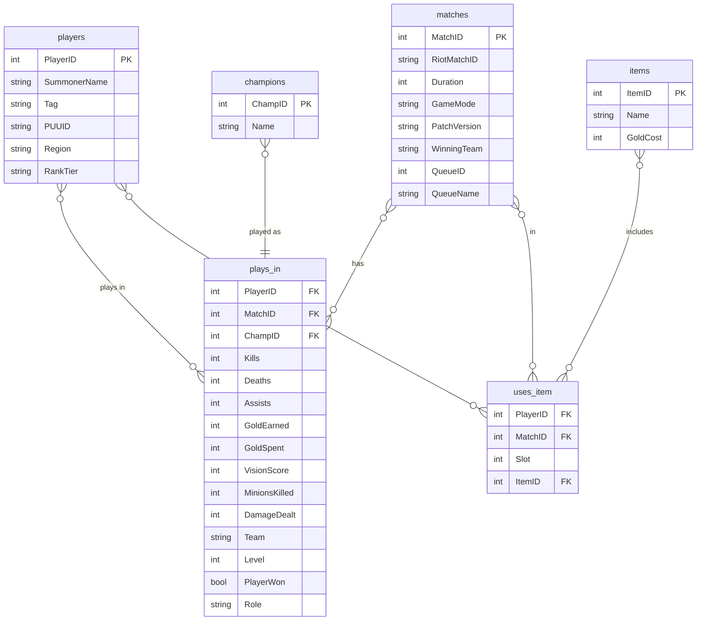

### Just a silly Python project messing with Riots API

## E/R Diagram

```mermaid
erDiagram
    players {
        int PlayerID PK
        string SummonerName
        string Tag
        string PUUID
        string Region
        string RankTier
    }

    matches {
        int MatchID PK
        string RiotMatchID
        int Duration
        string GameMode
        string PatchVersion
        string WinningTeam
        int QueueID
        string QueueName
    }

    champions {
        int ChampID PK
        string Name
    }

    items {
        int ItemID PK
        string Name
        int GoldCost
    }

    plays_in {
        int PlayerID FK
        int MatchID FK
        int ChampID FK
        int Kills
        int Deaths
        int Assists
        int GoldEarned
        int GoldSpent
        int VisionScore
        int MinionsKilled
        int DamageDealt
        string Team
        int Level
        bool PlayerWon
        string Role
    }

    uses_item {
        int PlayerID FK
        int MatchID FK
        int Slot
        int ItemID FK
    }

    players }o--o{ plays_in : "plays in"
    matches }o--o{ plays_in : "has"
    champions }o--|| plays_in : "played as"
    players }o--o{ uses_item : "uses"
    matches }o--o{ uses_item : "in"
    items }o--o{ uses_item : "includes"
```
